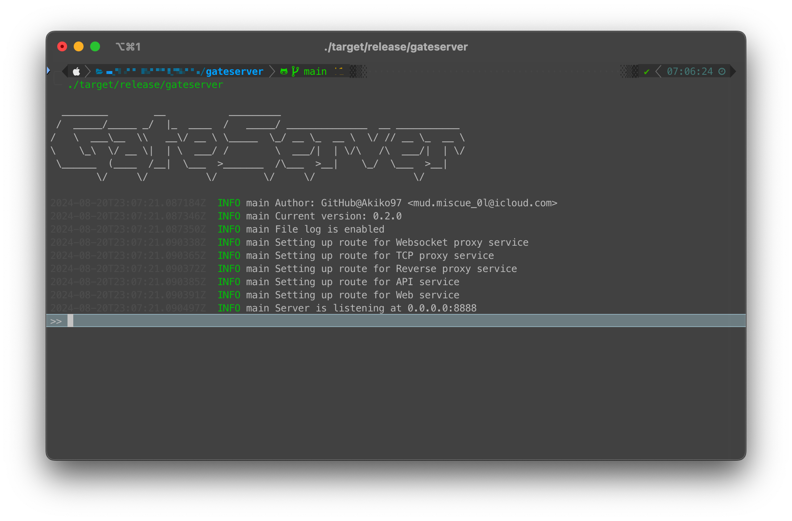

# GateServer

This project is a flexible server built using Rust's `axum` framework, providing multiple functionalities including a Web Server, WebSocket Proxy, TCP Proxy, and Reverse Proxy. The server's behavior can be configured via a configuration file, which is generated automatically upon the first run.



## Features

* Web Server: Serves static files from a specified directory.
* WebSocket Proxy: Forwards WebSocket connections to a designated backend server.
* TCP Proxy: Forwards TCP connections to a designated backend server.
* Reverse Proxy: Forwards HTTP requests to a designated backend server.

## Configuration

Upon the first execution of the server, a configuration file is generated automatically. The configuration file contains sections for each feature, which can be enabled or disabled by removing or commenting out the corresponding section (except for the `[server]` section, which is mandatory).

### Example Configuration

```toml
[server]
host = "localhost" # The hostname or IP address on which the server listens.
port = 8888 # The port number on which the server listens.
file_log = true # Whether to write log to file.

[web]
path = "/" # The URL path at which to serve the static files.
dist_path = "dist" # The directory containing the static files.
spa_support = true # The option indicates whether the server supports SPA.

[websocket_proxy]
path = "/ws" # The URL path for the WebSocket proxy.
forward_to = "ws://127.0.0.1:8000" # The backend WebSocket server to which the connections are forwarded.

[tcp_proxy]
path = "/tcp" # The URL path for the TCP proxy.
forward_to = "127.0.0.1:8080" # The backend TCP server to which the connections are forwarded.

[reverse_proxy]
path = "/proxy" # The URL path for the reverse proxy.
forward_to = "http://localhost:5173" # The backend HTTP server to which the requests are forwarded.
```

## Installation

### Clone the repository

```shell
git clone https://github.com/Akiko97/gateserver.git
cd gateserver
```

### Build the project

```shell
cargo build --release
```

### Clone the repository

```shell
cargo run --release
```

## Usage

Once the server is running, it will automatically generate the configuration file. Modify the configuration file as needed to enable or disable specific functionalities. Restart the server after making changes to the configuration file.

## License

This project is licensed under the GNU Affero General Public License (AGPL). See the `LICENSE` file for details.

## Third-Party Licenses

This project uses third-party libraries. The licenses for these libraries can be found in the `LICENSES-THIRD-PARTY` file.
